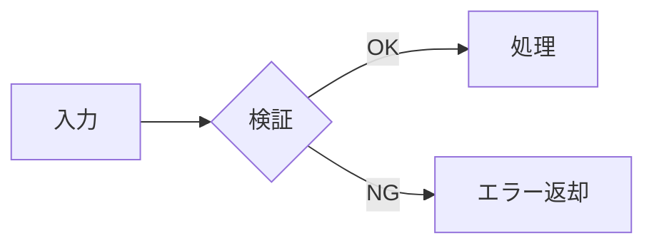

# ドキュメント作成ガイドライン

このリポジトリに置くドキュメントの書き方をまとめる。
公開・共有される前提のため、読み手は「文脈を知らない外部の人」を想定する。

## 1. 1 ファイル 1 テーマ

1 つのファイルで扱うテーマは 1 つにする。
「設計」と「運用手順」が混ざると、片方だけ更新されて内容がずれていく。
分量が増えたら分割し、相互にリンクを張る。

## 2. 冒頭に「何のための文書か」を書く

タイトルの直後に、2〜3 行で次を書く。

- この文書が答えている問い
- 想定する読み手
- 読み終えたときに分かること

目次から書き始めない。読み手は目次ではなく結論を探している。

## 3. 決定は理由とセットで書く

設計資料で最も腐りにくいのは「なぜそう決めたか」の部分である。
選んだ案だけでなく、**採らなかった案とその理由**を残す。

```text
採用: A 方式
理由: B 方式は初期実装は軽いが、後から C の制約を満たせなくなる
再検討の条件: C の制約が外れたとき
```

「再検討の条件」を書いておくと、あとから読んだ人が
その決定を覆してよいかどうかを自分で判断できる。

## 4. 具体名を書きすぎない

公開リポジトリなので、次は書かない。

- 非公開リポジトリ名、内部ホスト名、プロジェクト ID
- 認証情報、トークン、個人情報
- 特定個人の評価に読める記述

具体例が必要な場合は、役割が分かる一般名（`api-server`、`batch-worker` など）に置き換える。

## 5. 一覧を手で書かない

ファイル一覧やコード上の項目一覧をドキュメントに転記すると、必ず実体とずれる。
一覧そのものではなく、**一覧の求め方**を書く。

```bash
# 例: 設定項目の一覧は grep で得る
grep -rn "config." ./src
```

## 6. 図は仕組みが分かるときだけ描く

見た目を整えるためだけの図は入れない。
描くなら、文章で説明すると長くなる「関係」や「順序」を対象にする。
Markdown 中では Mermaid を使う。



## 7. 更新の跡を残す

差し替え時は、次のいずれかで変更内容を追えるようにする。

- コミットメッセージに何を変えたかを書く
- 文書末尾に更新履歴を置く（大きな方針転換があった場合のみ）

日付は「先月」「最近」ではなく `2026-08-31` のような絶対日付で書く。
相対表現は、読まれる時点では必ず意味が変わっている。

## 8. ファイル名

- 英小文字とハイフンのみ（`documentation-guideline.md`）
- 日本語・空白・大文字は使わない（URL やコマンドラインで扱いにくい）
- 内容が変わったらファイル名も変える。中身だけ差し替えると、リンク先の期待とずれる

## チェックリスト

公開前に確認する。

- [ ] 冒頭に目的と想定読者が書かれている
- [ ] 設計判断に理由が添えられている
- [ ] 非公開の固有名詞・認証情報が含まれていない
- [ ] 手で書き写した一覧が含まれていない
- [ ] 相対日付を使っていない
